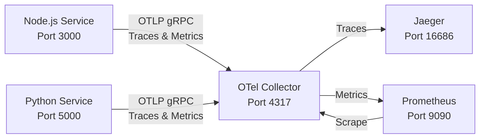

# OpenTelemetry OTCA Training System

A comprehensive test system for learning and training for the **OpenTelemetry Certified Associate (OTCA)** exam by the Linux Foundation. This mini-system demonstrates core OpenTelemetry concepts through a practical, hands-on setup with multiple services, instrumentation, and observability backends.

## Prerequisites

- Docker (version 20.10 or later)
- Docker Compose (version 2.0 or later)

## System Architecture

This training system consists of:

- **Node.js Service**: Express application with OpenTelemetry instrumentation
- **Python Service**: Flask application with OpenTelemetry instrumentation
- **OpenTelemetry Collector**: Receives, processes, and exports telemetry data
- **Jaeger**: Distributed tracing backend for visualizing traces
- **Prometheus**: Metrics storage and querying system

### Data Flow



The telemetry pipeline works as follows:

1. **Instrumentation**: Both services generate traces and metrics through automatic and manual instrumentation
2. **Export**: Services export telemetry data via OTLP (OpenTelemetry Protocol) to the Collector
3. **Processing**: The Collector receives, batches, and processes the telemetry data
4. **Export**: The Collector exports traces to Jaeger and metrics to Prometheus
5. **Visualization**: Jaeger UI and Prometheus UI provide visualization and analysis capabilities

## Exam Topics Coverage

This training system covers all major topics of the OTCA exam. Below is a detailed mapping of exam topics to system components:

### Fundamentals of Observability (18%)

#### Telemetry Data
- **Traces**: Both Node.js and Python services generate distributed traces showing request flows
- **Metrics**: Both services create counter metrics (`requests_total`) to track request counts
- **Location**: See `service-node/app.js` and `service-python/app.py` for metric and trace generation

#### Semantic Conventions
- **Resource Attributes**: Python service sets `service.name` resource attribute (line 13 in `app.py`)
- **Span Attributes**: Automatic instrumentation adds semantic conventions for HTTP requests, service names, etc.
- **Location**: Resource creation in `service-python/app.py`, automatic attributes via instrumentation

#### Instrumentation
- **Automatic Instrumentation**: 
  - Express instrumentation in Node.js (`@opentelemetry/instrumentation-express`)
  - Flask instrumentation in Python (`opentelemetry-instrumentation-flask`)
- **Manual Instrumentation**: 
  - Manual span creation in Python (`tracer.start_as_current_span`)
  - Manual metric creation in both services
- **Location**: `service-node/app.js` lines 22-24, `service-python/app.py` lines 16-17, 26

#### Analysis and Outcomes
- **Trace Analysis**: Jaeger UI (http://localhost:16686) for visualizing trace flows and spans
- **Metric Analysis**: Prometheus UI (http://localhost:9090) for querying and visualizing metrics
- **Location**: Access via browser after starting the system

### The OpenTelemetry API and SDK (46%)

#### Data Model
- **Spans**: Represent operations in traces (see `service-python/app.py` line 26)
- **Metrics**: Counter metrics created in both services (`requests_total`)
- **Resources**: Service identification via Resource API (Python service line 13)
- **Location**: `service-node/app.js` lines 20, `service-python/app.py` lines 13, 22, 26

#### Composability and Extension
- **Span Processors**: `BatchSpanProcessor` used in both services for efficient batching
- **Metric Readers**: `PeriodicExportingMetricReader` for metrics export
- **Custom Components**: Can be extended with custom processors, exporters, or samplers
- **Location**: `service-node/app.js` lines 13, 17, `service-python/app.py` lines 15, 19

#### Configuration
- **Environment Variables**: 
  - `OTEL_EXPORTER_OTLP_ENDPOINT`: Collector endpoint
  - `OTEL_TRACES_EXPORTER`: Trace exporter type
  - `OTEL_METRICS_EXPORTER`: Metrics exporter type
- **SDK Configuration**: Programmatic configuration in application code
- **Location**: `docker-compose.yaml` lines 12-15, 24-27, application files

#### Signals
- **Tracing**: 
  - Node.js: Express auto-instrumentation + manual spans
  - Python: Flask auto-instrumentation + manual spans
- **Metrics**: 
  - Node.js: Counter metric via Meter API
  - Python: Counter metric via Meter API
- **Logs**: Can be added using OpenTelemetry logging SDK
- **Location**: Both service files demonstrate traces and metrics

#### SDK Pipelines
- **Trace Pipeline**: 
  - TracerProvider → BatchSpanProcessor → OTLP Exporter
  - Node.js: Lines 12-14 in `app.js`
  - Python: Lines 13-16 in `app.py`
- **Metrics Pipeline**: 
  - MeterProvider → PeriodicExportingMetricReader → OTLP Exporter
  - Node.js: Lines 16-18 in `app.js`
  - Python: Lines 19-20 in `app.py`

#### Context Propagation
- **Automatic Propagation**: Express and Flask instrumentations automatically propagate trace context
- **W3C Trace Context**: OpenTelemetry uses W3C Trace Context standard for propagation
- **Cross-Service Tracing**: Context propagated through HTTP headers between services
- **Location**: Automatic via instrumentation libraries

#### Agents
- **OpenTelemetry Collector**: Acts as an agent receiving telemetry from services
- **Configuration**: Collector configured via `otel-config.yaml`
- **Deployment**: Collector runs as separate container in Docker Compose
- **Location**: `docker-compose.yaml` lines 29-38, `otel-config.yaml`

### The OpenTelemetry Collector (26%)

#### Configuration
- **Receiver Configuration**: OTLP receiver configured for gRPC and HTTP protocols
- **Processor Configuration**: Batch processor for efficient data handling
- **Exporter Configuration**: Jaeger exporter for traces, Prometheus exporter for metrics
- **Pipeline Configuration**: Separate pipelines for traces and metrics
- **Location**: `otel-config.yaml` - complete collector configuration

#### Deployment
- **Docker Compose**: Collector deployed as containerized service
- **Volume Mounts**: Configuration file mounted into container
- **Ports**: Exposes OTLP endpoints (4317 gRPC, 55681 HTTP)
- **Location**: `docker-compose.yaml` lines 29-38

#### Scaling
- **Horizontal Scaling**: Collector can be scaled independently of application services
- **Load Distribution**: Multiple collector instances can handle telemetry from multiple services
- **Location**: `docker-compose.yaml` - collector as separate service

#### Pipelines
- **Trace Pipeline**: `otlp` receiver → `batch` processor → `jaeger` exporter
- **Metrics Pipeline**: `otlp` receiver → `batch` processor → `prometheus` exporter
- **Pipeline Definition**: Defined in `service.pipelines` section
- **Location**: `otel-config.yaml` lines 16-25

#### Transforming Data
- **Batch Processor**: Batches spans and metrics for efficient export
- **Data Transformation**: Can add processors like `attributes`, `resource`, `transform` for data modification
- **Location**: `otel-config.yaml` lines 7-9, 18, 24

### Maintaining and Debugging Observability Pipelines (10%)

#### Context Propagation
- **Cross-Service Tracing**: Trace context propagated between services via HTTP headers
- **Verification**: Check Jaeger UI to see complete trace flows across services
- **Debugging**: Inspect trace context in Jaeger span details

#### Debugging Pipelines
- **Collector Logs**: View collector logs with `docker logs otel-collector`
- **Jaeger UI**: Visual debugging of trace flows and span details
- **Prometheus Queries**: Debug metrics using PromQL queries
- **Location**: Use Docker logs and web UIs for debugging

#### Error Handling
- **Collector Error Handling**: Collector handles export failures gracefully
- **Retry Logic**: Batch processor includes retry mechanisms
- **Monitoring**: Monitor collector health via logs and metrics
- **Location**: Collector configuration and logs

#### Schema Management
- **OTLP Protocol**: System uses OTLP (OpenTelemetry Protocol) for data transmission
- **Schema Compliance**: OTLP ensures schema compatibility between components
- **Version Management**: OpenTelemetry SDK and Collector versions should be compatible
- **Location**: OTLP exporters in both services, OTLP receiver in collector

## Quick Start

### 1. Start the System

```bash
docker-compose up -d
```

This command starts all services in detached mode:
- Node.js service on port 3000
- Python service on port 5000
- OpenTelemetry Collector
- Jaeger UI on port 16686
- Prometheus on port 9090

### 2. Generate Telemetry

Generate some requests to create telemetry data:

```bash
# Generate requests to Node.js service
curl http://localhost:3000/hello

# Generate requests to Python service
curl http://localhost:5000/hello
```

### 3. View Telemetry

- **Jaeger UI**: Open http://localhost:16686 in your browser
  - Click "Search" to see traces
  - Select a service and click "Find Traces"
  - Click on a trace to see span details

- **Prometheus UI**: Open http://localhost:9090 in your browser
  - Go to "Graph" tab
  - Query: `requests_total` to see metrics
  - Explore different metric queries

### 4. Stop the System

```bash
docker-compose down
```

## Project Structure

```
otca-mini-system/
├── docker-compose.yaml      # Service orchestration and configuration
├── otel-config.yaml         # OpenTelemetry Collector configuration
├── prometheus.yml           # Prometheus scrape configuration
├── service-node/            # Node.js service with instrumentation
│   ├── app.js              # Main application with OTel SDK setup
│   └── package.json       # Node.js dependencies
└── service-python/         # Python service with instrumentation
    ├── app.py             # Main application with OTel SDK setup
    └── requirements.txt   # Python dependencies
```

### File Descriptions

- **`docker-compose.yaml`**: Defines all services, their configurations, environment variables, and networking
- **`otel-config.yaml`**: OpenTelemetry Collector configuration including receivers, processors, exporters, and pipelines
- **`prometheus.yml`**: Prometheus configuration for scraping metrics from the Collector
- **`service-node/app.js`**: Node.js Express application with OpenTelemetry SDK setup, instrumentation, and manual metric creation
- **`service-node/package.json`**: Node.js dependencies including OpenTelemetry packages
- **`service-python/app.py`**: Python Flask application with OpenTelemetry SDK setup, instrumentation, and manual metric creation
- **`service-python/requirements.txt`**: Python dependencies including OpenTelemetry packages

## Configuration Details

### Environment Variables

Both services use the following environment variables (configured in `docker-compose.yaml`):

- **`OTEL_EXPORTER_OTLP_ENDPOINT`**: `http://otel-collector:4317`
  - Sets the OTLP endpoint where telemetry is sent
  - Uses gRPC protocol on port 4317

- **`OTEL_TRACES_EXPORTER`**: `otlp`
  - Configures the trace exporter to use OTLP

- **`OTEL_METRICS_EXPORTER`**: `otlp`
  - Configures the metrics exporter to use OTLP

### Collector Pipeline Configuration

The Collector configuration (`otel-config.yaml`) defines:

1. **Receivers**: OTLP receiver accepting gRPC and HTTP protocols
2. **Processors**: Batch processor for efficient data batching
3. **Exporters**: 
   - Jaeger exporter for traces (endpoint: `http://jaeger:14268/api/traces`)
   - Prometheus exporter for metrics (endpoint: `0.0.0.0:8888`)
4. **Pipelines**: 
   - Trace pipeline: OTLP → Batch → Jaeger
   - Metrics pipeline: OTLP → Batch → Prometheus

### OTLP Endpoint Configuration

- **gRPC Endpoint**: Port 4317 (default OTLP gRPC port)
- **HTTP Endpoint**: Port 55681 (default OTLP HTTP port)
- Services connect to the Collector using the service name `otel-collector` (Docker Compose networking)

## Learning Exercises

### Exercise 1: Understanding Telemetry Data
1. Start the system and generate requests
2. In Jaeger, identify different span types (HTTP, custom spans)
3. In Prometheus, query the `requests_total` metric
4. **Learning Goal**: Understand the difference between traces and metrics

### Exercise 2: Instrumentation Types
1. Compare automatic instrumentation (Express/Flask) vs manual instrumentation
2. Add a new manual span in one of the services
3. Add a new metric (gauge or histogram) to track response times
4. **Learning Goal**: Understand when to use automatic vs manual instrumentation

### Exercise 3: Collector Configuration
1. Modify `otel-config.yaml` to add a new processor (e.g., `attributes` processor)
2. Add resource attributes to spans
3. Experiment with different exporter configurations
4. **Learning Goal**: Understand Collector pipeline configuration

### Exercise 4: Context Propagation
1. Make the Node.js service call the Python service
2. Verify in Jaeger that traces span both services
3. Inspect trace context in span attributes
4. **Learning Goal**: Understand distributed tracing and context propagation

### Exercise 5: Debugging Pipelines
1. Intentionally break the Collector configuration
2. Check Docker logs: `docker logs otel-collector`
3. Fix the configuration and verify telemetry flows again
4. **Learning Goal**: Learn to debug observability pipeline issues

### Exercise 6: Schema Management
1. Change the OTLP endpoint to use HTTP instead of gRPC
2. Modify exporter configuration
3. Verify data still flows correctly
4. **Learning Goal**: Understand OTLP protocol and schema compatibility

## Troubleshooting

### No Traces in Jaeger
- Check that services are running: `docker ps`
- Verify Collector is receiving data: `docker logs otel-collector`
- Ensure services can reach Collector: Check network connectivity
- Verify OTLP endpoint configuration in environment variables

### No Metrics in Prometheus
- Check Prometheus targets: http://localhost:9090/targets
- Verify Collector metrics endpoint: `curl http://localhost:8888/metrics`
- Check Prometheus scrape configuration in `prometheus.yml`
- Verify Collector is exporting metrics correctly

### Services Not Starting
- Check Docker logs: `docker logs <service-name>`
- Verify dependencies are installed (Node.js: `npm install`, Python: `pip install -r requirements.txt`)
- Check port conflicts: Ensure ports 3000, 5000, 16686, 9090 are available

### Collector Errors
- View Collector logs: `docker logs otel-collector`
- Verify `otel-config.yaml` syntax is correct
- Check that exporters can reach their destinations (Jaeger, Prometheus)
- Verify network connectivity between containers

## Additional Resources

### OpenTelemetry Documentation
- [OpenTelemetry Documentation](https://opentelemetry.io/docs/)
- [OpenTelemetry Collector Documentation](https://opentelemetry.io/docs/collector/)
- [OpenTelemetry Semantic Conventions](https://opentelemetry.io/docs/specs/semconv/)
- [OTLP Protocol Specification](https://opentelemetry.io/docs/specs/otlp/)

### OTCA Exam Resources
- [Linux Foundation OpenTelemetry Certification](https://training.linuxfoundation.org/certification/certified-opentelemetry-associate/)
- [OTCA Exam Guide](https://training.linuxfoundation.org/certification/certified-opentelemetry-associate/)

### Learning Materials
- [OpenTelemetry Getting Started](https://opentelemetry.io/docs/getting-started/)
- [OpenTelemetry Instrumentation Libraries](https://opentelemetry.io/docs/instrumentation/)
- [OpenTelemetry Best Practices](https://opentelemetry.io/docs/best-practices/)

## License

This is a training system for educational purposes.
